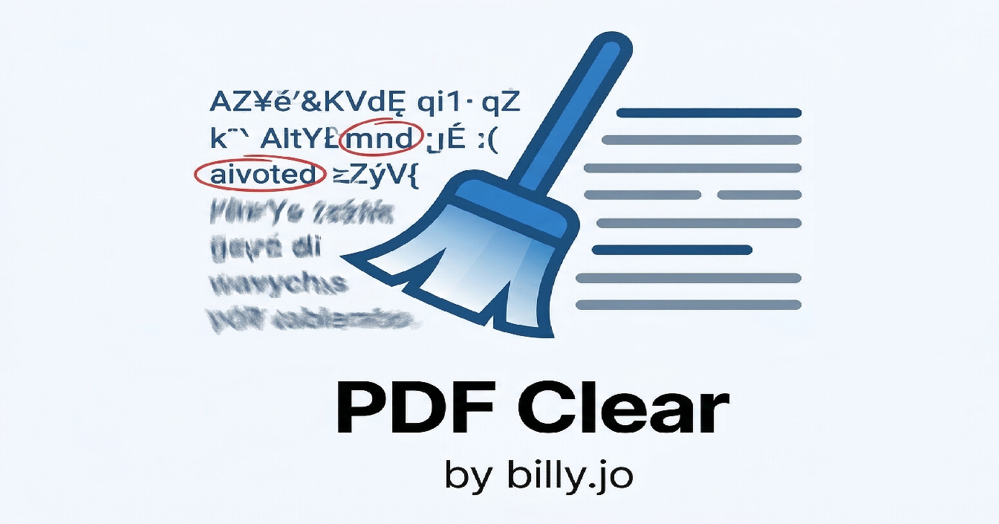

<p align="center">
  
</p>

# PDF-Clear

A client-side web application for erasing/filling regions in PDF files. Users load a PDF, select rectangular regions via mouse drag, choose a fill color mode, and download the modified PDF or export as PPT. All processing happens in the browser — no backend server.

---

## Features

- **PDF Loading**: Load local PDF files and view them directly in the browser
- **Region Selection**: Select rectangular regions by left-click dragging
- **Bulk Delete**: Right-click drag to select an area, then left-click to delete all selections within
- **Color Fill Modes**:
  - **Dominant**: Fill with the most frequent color in the selected region
  - **Border**: Fill with the average color of the region's edges
  - **Custom**: Pick any color using the color picker
- **Group Selections**: Apply selections across multiple pages with scope management
- **Page-Level Batch Operations**: Apply/Revert/Delete all selections on current page
- **Group Tooltips**: Hover over group indicators to see target pages
- **Auto Text Detection**: Automatically detect text regions using OCR
- **Export**: Download modified PDF or export as PowerPoint (PPT)
- **Page Navigation**: First/Previous/Next/Last page buttons for easy navigation
- **Selection Management**: View and manage individual selections with revert capability

---

## How to Use

### Basic Workflow
1. **Select PDF**: Click the "Select PDF" button to upload a PDF file
2. **Choose Color Mode**: Select your preferred fill color mode (Dominant/Border/Custom)
3. **Select Regions**: Left-click drag on the PDF page to select regions you want to fill
4. **Apply**: Click "Apply" for current page or "Apply All" to apply selections (supports scope: Current/All/Range)
5. **Download**: Click "Download PDF" for modified PDF or "Download PPT" for PowerPoint export

### Advanced Features
- **Bulk Delete**: Right-click drag to select an area (blue box), then left-click to delete all selections in that area (group selections are preserved)
- **Group Management**: When applying to multiple pages, selections are grouped with visual indicators
- **Revert**: Click "Revert" on applied selections to return to pending state (preserves original scope/range)
- **Page Batch Operations**: Use per-page Apply/Revert/Delete buttons in the selection list header
- **Auto Detect** (optional): Click "Auto Detect Text" to automatically detect text regions using OCR

---

## Running Locally

No build step or package manager required. Simply open `index.html` directly in your browser.

---

## Web Version

You can also use the web version at: **https://billyjodev.github.io/pdf-clear**

---

## SEO & GEO Optimization

The application is optimized for search engines and international audiences:

### Meta Tags
- **Description**: Clear, keyword-rich description for search results
- **Keywords**: Relevant terms for PDF editing, privacy, and online tools
- **Open Graph**: Social media sharing optimization (Facebook, LinkedIn)
- **Twitter Cards**: Enhanced sharing on X/Twitter
- **Canonical URL**: Prevents duplicate content issues

### Structured Data (JSON-LD)
- **WebApplication** schema for better search understanding
- **SoftwareApplication** schema for app store-like listings
- Feature lists and ratings for rich snippets

### GEO Targeting
- **hreflang** tags for English and Korean audiences
- **x-default** for global audience targeting
- Language-aware content delivery

### Performance
- **Preconnect** hints for CDN resources
- **dns-prefetch** for analytics services
- Browser caching headers (via .htaccess)

### Accessibility
- Semantic HTML5 elements (main, nav, aside, section, footer)
- ARIA labels for screen readers
- Skip-to-content link for keyboard navigation
- Focus management and live regions

### Additional Files
- `robots.txt`: Search engine crawling instructions
- `sitemap.xml`: Site structure for search engines
- `site.webmanifest`: PWA manifest for installable app
- `.htaccess`: Server configuration for performance and security

---

## Tech Stack

| Library | Version | Purpose |
|---------|---------|---------|
| **PDF.js** | 3.11.174 | PDF rendering to canvas |
| **pdf-lib** | 1.17.1 | PDF modification for download |
| **PptxGenJS** | 3.12.0 | PowerPoint export |
| **Tesseract.js** | 5.x | OCR-based text detection |
| **Tailwind CSS** | (CDN) | Styling |

---

## Licenses

This project uses the following open-source libraries:

### PDF.js
- **License**: Apache-2.0
- **Source**: https://github.com/mozilla/pdf.js
- **CDN**: https://cdnjs.cloudflare.com/ajax/libs/pdf.js/3.11.174/

### pdf-lib
- **License**: MIT
- **Source**: https://github.com/Hopding/pdf-lib
- **CDN**: https://unpkg.com/pdf-lib@1.17.1/

### PptxGenJS
- **License**: MIT
- **Source**: https://github.com/gitbrent/pptxgenjs
- **CDN**: https://cdn.jsdelivr.net/npm/pptxgenjs@3.12.0/

### Tesseract.js
- **License**: Apache-2.0
- **Source**: https://github.com/naptha/tesseract.js
- **CDN**: https://cdn.jsdelivr.net/npm/tesseract.js@5/

### Tailwind CSS
- **License**: MIT
- **Source**: https://tailwindcss.com/
- **CDN**: https://cdn.tailwindcss.com

---

## Privacy Notice

- All processing happens locally in your browser
- No data is sent to any server
- Your PDF files never leave your device

---

## Browser Compatibility

Works on modern browsers that support:
- Canvas API
- ES6+ JavaScript
- File API

Recommended: Chrome, Firefox, Edge, Safari (latest versions)

---

## Project Structure

```
pdf-clear/
├── index.html    # Main HTML file
├── app.js        # Application logic (single-class design)
└── README.md     # This file
```

---

## Architecture

The application uses a single-class design in `app.js`: `PdfRegionEraser` manages all state and DOM interaction.

### Core Data Model
- `pagesData[]` — per-page state: `selections` (applied fills) and `pendingSelections` (drawn but not yet applied)
- All coordinates are normalized to 0–1 range relative to page dimensions, enabling resolution-independent storage
- Color modes: `dominant` (most frequent color in region), `border` (average of edge pixels), `custom` (user-picked hex)

### Rendering Flow
1. PDF page → canvas via PDF.js at an optimal scale fitting the viewport
2. Applied selections are drawn as filled rectangles on the canvas
3. Pending selections appear as dashed red overlay boxes (DOM elements, not canvas)
4. On download, selections are replayed onto the original PDF via pdf-lib using normalized coordinates

### Coordinate System Note
PDF.js canvas uses top-left origin; pdf-lib uses bottom-left origin. The `downloadModifiedPdf` method flips Y: `y = height - (sel.y + sel.height) * height`.

---

## Notes

- Large PDF files may take some time to load
- OCR text detection requires Tesseract.js to be loaded (automatic on first use)
- All UI text is in Korean

---

## License

This project is open source and available under the MIT License.

---

---

# PDF 영역 지우기 도구

PDF 파일의 특정 영역을 선택하고 지정한 색상으로 채울 수 있는 웹 애플리케이션입니다. 모든 처리는 브라우저에서 이루어지며 별도의 서버가 필요 없습니다.

---

## 기능

- **PDF 파일 로드**: 로컬 PDF 파일을 불러와서 브라우저에서 바로 뷰어
- **좌측 클릭 드래그 선택**: 마우스 좌측 드래그로 박스 영역 선택
- **우측 클릭 일괄 삭제**: 우측 드래그로 영역 선택(파란 박스), 좌측 클릭으로 해당 영역 내 선택영역 일괄 삭제
- **색상 채우기 모드**:
  - **최빈**: 선택 영역에서 가장 많이 나타나는 색상으로 채우기
  - **테두리**: 선택 영역 테두리의 평균 색상으로 채우기
  - **지정**: 색상 선택기에서 원하는 색상 지정
- **그룹 선택영역**: 여러 페이지에 걸친 선택영역을 그룹으로 관리
- **페이지별 일괄 작업**: 현재 페이지의 선택영역 Apply/Revert/Delete 버튼
- **그룹 표시기 툴팁**: 그룹 표시에 호버하면 대상 페이지 표시
- **텍스트 자동 감지**: OCR을 사용하여 텍스트 영역 자동 감지
- **내보내기**: 수정된 PDF 다운로드 또는 PPT로 내보내기
- **페이지 네비게이션**: 처음/이전/다음/마지막 페이지 버튼으로 쉬운 navigation
- **선택 영역 관리**: 개별 선택 영역 확인 및 되돌리기 기능

---

## 사용법

### 기본 워크플로우
1. **PDF 파일 선택**: 'Select PDF' 버튼을 클릭하여 PDF 파일을 업로드
2. **색상 모드 선택**: 원하는 채우기 색상 모드 선택 (Dominant/Border/Custom)
3. **영역 선택**: PDF 페이지에서 **좌측 마우스 드래그**로 지울 영역을 선택
4. **적용**: 'Apply' 버튼으로 현재 페이지에 적용하거나, 'Apply All'로 다른 페이지에도 적용 (범위 설정: 현재/모두/지정 페이지)
5. **다운로드**: 'Download PDF' 클릭하여 수정된 PDF 다운로드 또는 'Download PPT'로 PPT 내보내기

### 고급 기능
- **일괄 삭제**: **우측 마우스 드래그**로 영역 선택(파란 박스)한 후 **좌측 클릭**하면 해당 영역 내 모든 선택영역 삭제 (그룹 선택영역은 유지)
- **그룹 관리**: 여러 페이지에 적용한 선택영역은 자동으로 그룹화되며 시각적 표시가 됨
- **되돌리기**: 적용된 선택영역의 'Revert' 버튼을 클릭하면 원래 옵션(범위, 색상 모드)을 유지한 채 대기 상태로 복원
- **페이지별 일괄 작업**: 선택영역 목록 헤더의 Apply/Revert/Delete 버튼으로 현재 페이지의 모든 선택영역 일괄 처리
- **텍스트 자동 감지** (선택 사항): 'Auto Detect Text' 버튼을 클릭하여 텍스트 영역 자동 감지

---

## 로컬 실행

빌드 과정이나 패키지 관리자가 필요 없습니다. `index.html` 파일을 브라우저에서 직접 열면 됩니다.

---

## 웹 버전

웹 버전도 이용 가능합니다: **https://billyjodev.github.io/pdf-clear**

---

## SEO 및 GEO 최적화

이 애플리케이션은 검색 엔진과 글로벌 사용자를 위해 최적화되어 있습니다:

### 메타 태그
- **설명**: 검색 결과를 위한 명확하고 키워드가 풍부한 설명
- **키워드**: PDF 편집, 프라이버시, 온라인 도구 관련 검색어
- **Open Graph**: 소셜 미디어 공유 최적화 (Facebook, LinkedIn)
- **Twitter Cards**: X/Twitter에서의 향상된 공유
- **Canonical URL**: 중복 콘텐츠 문제 방지

### 구조화된 데이터 (JSON-LD)
- **WebApplication** 스키마로 검색 엔진 이해도 향상
- **SoftwareApplication** 스키마로 앱 스토어 스타일 목록
- 기능 목록과 평점을 통한 리치 스니펫 지원

### GEO 타겟팅
- **hreflang** 태그로 영어 및 한국어 사용자 타겟팅
- **x-default**로 글로벌 사용자 타겟팅
- 언어 인식 콘텐츠 전달

### 성능
- CDN 리소스를 위한 **preconnect** 힌트
- 분석 서비스를 위한 **dns-prefetch**
- 브라우저 캐싱 헤더 (.htaccess 통해)

### 접근성
- 시맨틱 HTML5 요소 (main, nav, aside, section, footer)
- 스크린 리더를 위한 ARIA 라벨
- 키보드 내비게이션을 위한 건너뛰기 링크
- 포커스 관리 및 라이브 리전

### 추가 파일
- `robots.txt`: 검색 엔진 크롤링 지시사항
- `sitemap.xml`: 검색 엔진을 위한 사이트 구조
- `site.webmanifest`: 설치 가능한 앱을 위한 PWA 매니페스트
- `.htaccess`: 성능 및 보안을 위한 서버 설정

---

## 기술 스택

| 라이브러리 | 버전 | 용도 |
|-----------|------|------|
| **PDF.js** | 3.11.174 | PDF를 캔버스에 렌더링 |
| **pdf-lib** | 1.17.1 | PDF 수정 및 다운로드 |
| **PptxGenJS** | 3.12.0 | PPT 내보내기 |
| **Tesseract.js** | 5.x | OCR 기반 텍스트 감지 |
| **Tailwind CSS** | (CDN) | 스타일링 |

---

## 라이선스

이 프로젝트는 다음 오픈 소스 라이브러리를 사용합니다:

### PDF.js
- **라이선스**: Apache-2.0
- **소스**: https://github.com/mozilla/pdf.js
- **CDN**: https://cdnjs.cloudflare.com/ajax/libs/pdf.js/3.11.174/

### pdf-lib
- **라이선스**: MIT
- **소스**: https://github.com/Hopding/pdf-lib
- **CDN**: https://unpkg.com/pdf-lib@1.17.1/

### PptxGenJS
- **라이선스**: MIT
- **소스**: https://github.com/gitbrent/pptxgenjs
- **CDN**: https://cdn.jsdelivr.net/npm/pptxgenjs@3.12.0/

### Tesseract.js
- **라이선스**: Apache-2.0
- **소스**: https://github.com/naptha/tesseract.js
- **CDN**: https://cdn.jsdelivr.net/npm/tesseract.js@5/

### Tailwind CSS
- **라이선스**: MIT
- **소스**: https://tailwindcss.com/
- **CDN**: https://cdn.tailwindcss.com

---

## 개인정보 안내

- 모든 처리는 브라우저에서 로컬로 수행됩니다
- 서버로 데이터가 전송되지 않습니다
- PDF 파일이 기기 밖으로 나가지 않습니다

---

## 브라우저 호환성

다음을 지원하는 최신 브라우저에서 작동:
- Canvas API
- ES6+ JavaScript
- File API

권장: Chrome, Firefox, Edge, Safari (최신 버전)

---

## 프로젝트 구조

```
pdf-clear/
├── index.html    # 메인 HTML 파일
├── app.js        # 애플리케이션 로직 (단일 클래스 설계)
└── README.md     # 이 파일
```

---

## 아키텍처

애플리케이션은 `app.js`의 단일 클래스 설계를 사용합니다: `PdfRegionEraser`가 모든 상태와 DOM 상호작용을 관리합니다.

### 핵심 데이터 모델
- `pagesData[]` — 페이지별 상태: `selections` (적용된 채우기) 및 `pendingSelections` (그려졌지만 아직 적용되지 않음)
- 모든 좌표는 페이지 크기에 상대적인 0–1 범위로 정규화되어 해상도 독립적 저장을 지원
- 색상 모드: `dominant` (영역에서 가장 빈번한 색), `border` (가장자리 픽셀 평균), `custom` (사용자 선택 hex)

### 렌더링 흐름
1. PDF 페이지 → PDF.js를 통해 뷰포트에 맞는 최적 스케일의 캔버스로
2. 적용된 선택 영역이 캔버스에 채워진 사각형으로 그려짐
3. 대기 중인 선택 영역은 점선 빨간색 오버레이 박스로 표시 (DOM 요소, 캔버스 아님)
4. 다운로드 시 정규화된 좌표를 사용하여 pdf-lib을 통해 원본 PDF에 선택 영역이 재생됨

### 좌표계 참고
PDF.js 캔버스는 좌상단 원점 사용; pdf-lib은 좌하단 원점 사용. `downloadModifiedPdf` 메서드는 Y를 반전: `y = height - (sel.y + sel.height) * height`.

---

## 참고사항

- 큰 PDF 파일의 경우 로딩 시간이 다소 걸릴 수 있습니다
- OCR 텍스트 감지는 Tesseract.js 로딩이 필요합니다 (처음 사용 시 자동 로딩)
- 모든 UI 텍스트는 영어로 제공됩니다

---

## 라이선스

이 프로젝트는 MIT 라이선스 하에 오픈 소스로 제공됩니다.
